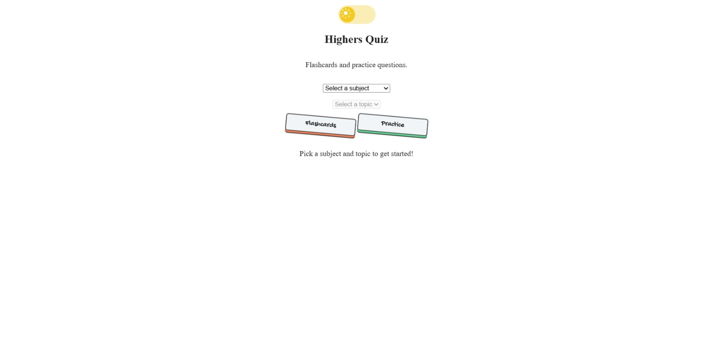

# Highers Quiz
A website where you can pick a subject and topic, then study with flashcards or test yourself with practice questions.

## ScreenShot

## Try It
[Demo Link](https://temi-ay.github.io/SQA-Higher/)

To try just open the link and pick a subject and topic to get started.

## Features
__Covers 8 subjects__:  Maths, Physics, Biology, Chemistry, Engineering Science, Modern Studies, English, and Computer Science.

Flashcard mode with a click-to-flip card and Previous/Next navigation.

Practice Questions mode with multiple-choice questions, instant right/wrong feedback, and a score at the end.

A dark mode toggle.

## How it works
__HTML__ for the structure

__CSS__ for the styling, uses Uiverse.io 

__JavaScript__ for the functionality
